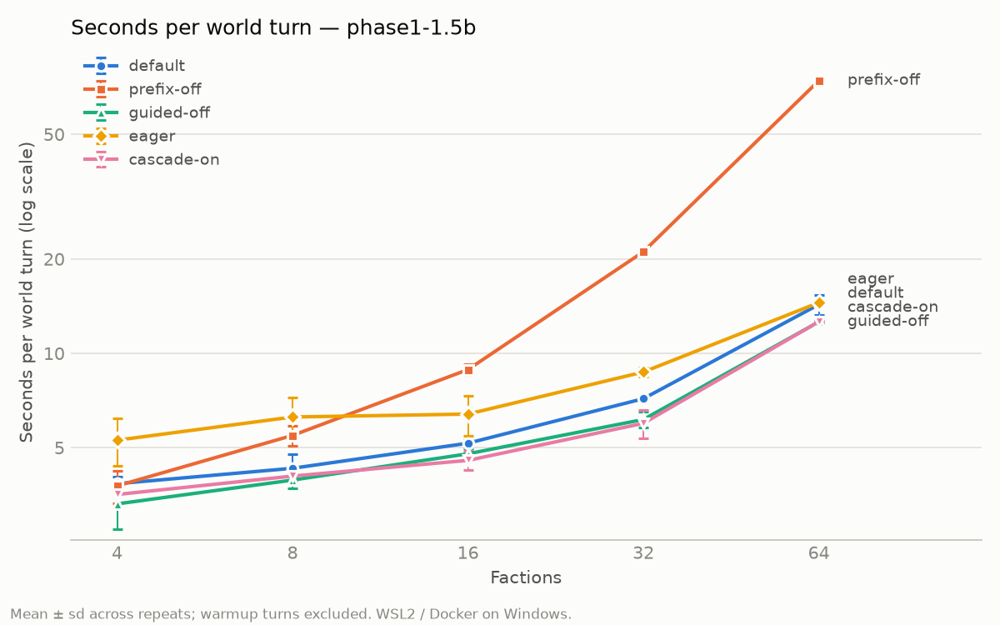

# statecraft-serving

How many LLM agents can one cheap GPU drive per decision cycle, and what makes that fast?

This repo answers that with a deliberately small, fully measured setup: a turn-based strategy
game where 4 to 64 LLM-driven factions each make one structured decision per turn, served by
vLLM on a single 8 GB laptop GPU. The game is the workload. The results are about serving.



## Why this matters: a toy model of a business problem

Many real LLM systems have the same shape as this game: **many agents, one shared context,
structured decisions, a cycle deadline, on constrained hardware.**

| In the game | In a business system (e.g. retail pricing and replenishment) |
|---|---|
| Faction | A store, region or account agent |
| Shared rules, map and world state | Shared context: catalog, policies, market data, last cycle's results |
| Faction's private section | That unit's own inventory, history and targets |
| JSON action (`build`, `trade_offer`, ...) | A structured decision sent to a system of record |
| Illegal action resolves to `pass` | Business-rule validation rejects the decision |
| `diplomatic_message` | Free-text note or customer-facing explanation |
| Narrator, streamed | The summary a human is waiting on |
| Seconds per world turn | Cycle time against a deadline |
| Legal action rate | Automation rate: decisions usable without a human |
| One 8 GB GPU | A cost or data-residency constraint (on-prem, edge) |

The same pattern shows up in support-ticket triage against a shared policy manual, claims
pre-screening, procurement agents bidding off one market snapshot, and synthetic-customer
simulations. **What transfers is the mechanisms, not the absolute seconds.**

## Findings (Qwen2.5-1.5B-Instruct, bf16, RTX 4070 Laptop 8 GB)

Seconds per world turn, mean of 3 seeded games x 5 timed turns each (warmup turn excluded):

| Factions | default | prefix caching off | guided decoding off | eager (no CUDA graphs) | cascade attention on |
|---|---|---|---|---|---|
| 4 | 3.84 | 3.78 | 3.31 | 5.28 | 3.55 |
| 8 | 4.30 | 5.47 | 3.94 | 6.26 | 4.06 |
| 16 | 5.17 | 8.87 | 4.78 | 6.40 | 4.55 |
| 32 | 7.17 | 21.09 | 6.15 | 8.72 | 5.98 |
| 64 | 14.31 | **74.12** | 12.60 | 14.51 | **12.62** |

Each variant changes exactly one thing relative to `default`. Run-to-run spread is about 7%
at small faction counts, so differences smaller than that are not claimed.

**1. Shared-prefix reuse is worth 5.2x at 64 agents.** Every prompt starts with the same rules,
map and world state; only the last 6-13% is agent-specific. With prefix caching, that shared
part is computed once (cache hit rate 81% at 4 factions, 93% at 64). Without it, every agent
recomputes it: per-turn prefill grows with agents x prompt length, and only ~8 full 8k-token
prompts fit in KV cache at once, so the rest queue. The penalty grows with scale: 1.0x at 4
factions, 2.9x at 32, 5.2x at 64. *Design rule: put shared material first, byte-identical
across agents. A test in this repo enforces it.*

**2. Cost grows faster than the number of agents.** The shared context itself grows with the
number of agents (a bigger world to describe: 1.4k prompt tokens at 4 factions, 8.1k at 64),
and every decode step reads every agent's full context from memory. Time per output token
rises from 17 ms at 4 factions to 121 ms at 64. Decode here is memory-bandwidth bound: at 64
factions each step reads an estimated 15 GB of KV cache (64 sequences x 8.1k tokens x 28 KiB)
against ~3 GB of weights. *Doubling agents
more than doubles cycle time; plan capacity accordingly.*

**3. Guided decoding costs 7-19% per token and is still worth it on a small model.** Without
a grammar, the 1.5B model produced valid JSON only 78-92% of the time (its most common slip:
omitting a required field). Output length is the same either way, so the speed difference is
the grammar's per-step cost. Decisions that *were* valid were legal at the same rate (~67%)
with or without the grammar: it fixes format, not judgment. Net usable decisions: ~66% guided
vs ~58% unguided, for 10-15% more cycle time.

**4. CUDA graphs win here; extra KV capacity does not.** `--enforce-eager` frees 1.08 GiB,
raising KV cache from 72k to 113k tokens (+55%), but the default never filled more than 61%
of its cache, so the capacity goes unused. What remains is per-kernel launch overhead: eager
is up to 1.46x slower at small batch and converges at 64 factions, where memory traffic
dominates each step. *Eager mode only pays when KV capacity is the binding constraint.*

**5. Cascade attention trims the shared-prefix memory traffic: about 12% at 64 agents.**
vLLM 0.30 can read a prefix shared by the whole batch once instead of once per sequence
(opt-in, and only with 8 or more requests). Time per output token drops 8-15% wherever it can
apply; the 4-faction difference is noise, since cascade cannot run there.

**6. Watch progress, not health.** In one earlier run with prefix caching off, vLLM stalled
under KV pressure: requests queued, zero tokens generated, `/health` still returned 200. The
harness now aborts a run when token counters stop moving with work pending
([note and log](results/phase1-1.5b/20261002T212801Z/prefix-off/NOTE.md)). It did not recur.

**Also measured:** KV cache size is predicted before every launch from the model architecture
and a calibrated memory split, then compared with vLLM's startup log; all five variants
landed within 1%. The first eager prediction missed by +31% because eager mode also disables
torch.compile memory, not only CUDA graphs. That miss and its fix are recorded in
[the model config](configs/models/qwen2.5-1.5b-instruct-bf16.yaml).

**Known limits.** One model on one laptop GPU under WSL2 / Docker Desktop (pinned host memory
is unavailable there), so absolute numbers will differ elsewhere. The narrator hit its
200-token cap in ~46% of turns. Legal action rate (~60-70%) reflects a 1.5B model playing a
game, not a production automation rate.

## How it works

- `sim/`: seeded world, pydantic action schema (exported as JSON schema for guided decoding),
  deterministic rules, prompts laid out most-stable-first, async agents, turn engine. Same seed
  and same model outputs replay identically.
- `bench/`: streaming client measuring TTFT and latency, vLLM container lifecycle, KV cache
  prediction, Prometheus scraping, stall watchdog, experiment harness.
- `configs/`: everything tunable. `game/` for balance, `models/` for model and memory
  calibration, `experiments/` for sweeps and variants.
- Every run writes `config.yaml`, `env.json` (image digest, flags, git commit, GPU, free VRAM,
  KV predicted vs actual), `requests.jsonl`, `turns.jsonl`, `outputs.jsonl` and
  `server_metrics.jsonl`.

## Reproduce

Requirements: Windows with Docker Desktop (WSL2) and an NVIDIA GPU, [uv](https://docs.astral.sh/uv/),
and the Qwen2.5-1.5B-Instruct weights in a Docker volume named `hf-cache`. vLLM is pinned by
digest (v0.30.0) in `docker-compose.yml`.

```powershell
uv sync
uv run pytest                                                         # no GPU needed
uv run python -m bench.harness configs/experiments/phase1-1.5b.yaml   # ~2.5 h, owns the GPU
uv run python -m analysis.plot_turns results/phase1-1.5b/<timestamp>
```

Add `--dry-run` to the harness to print the plan and KV predictions without starting vLLM.

## Speculative decoding

The sibling repo [speculative-statecraft](https://github.com/GIO443/speculative-statecraft)
builds on this one: it trains an EAGLE-1 draft head on this game's own outputs and runs it
through the same harness. In short: the workload-trained head beats n-gram speculation at
every load and makes turns up to 1.34x faster at 4-16 factions, but every form of speculation
is slower than none from 32 concurrent requests up, and on 8 GB a generic small draft model
does not fit at all.
